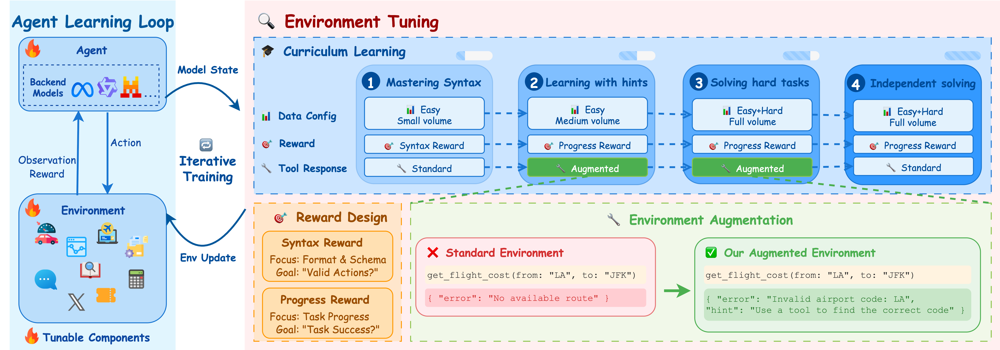
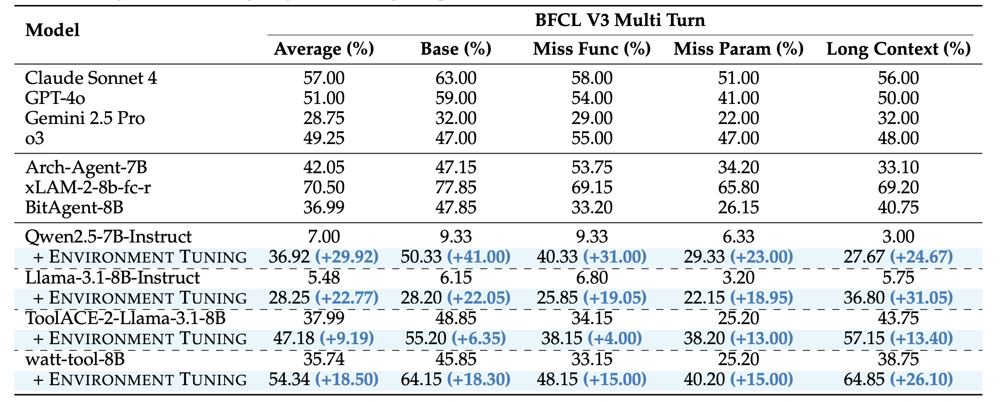
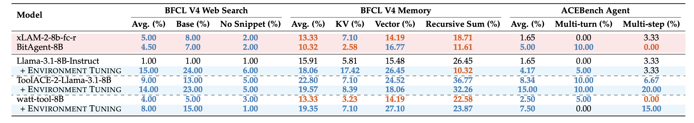
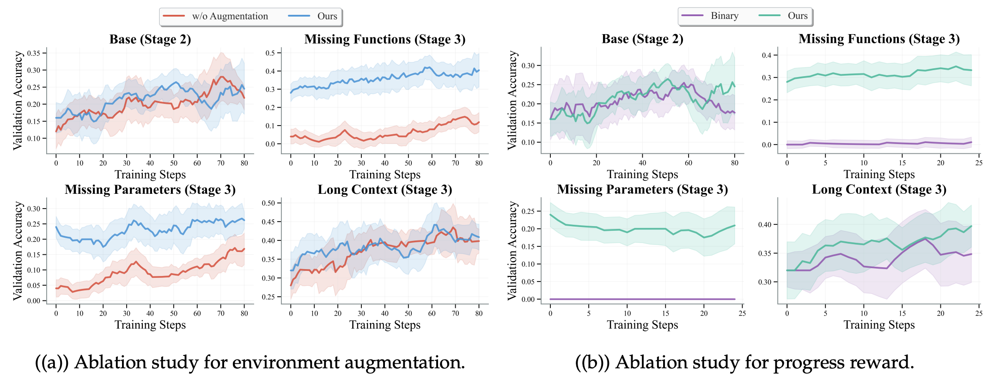
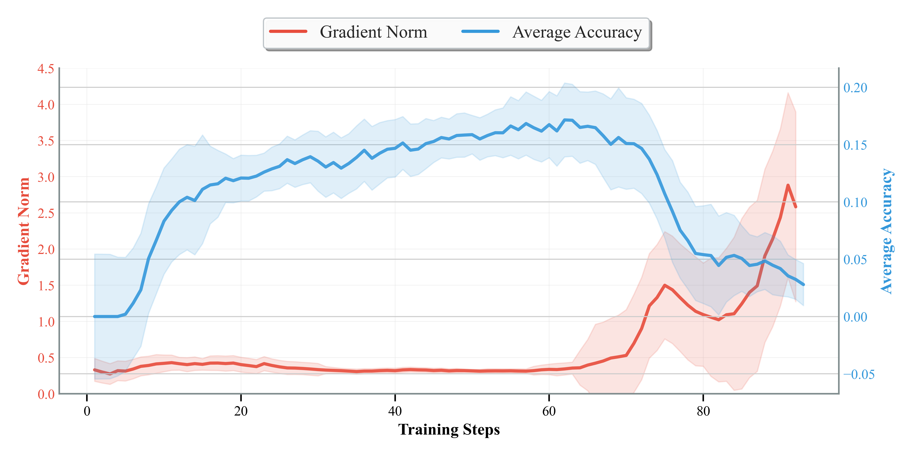

<div align="center">

# 🚀 Don't Just Fine-tune the Agent, <br> Tune the Environment 🌱

[](https://arxiv.org/abs/2510.10197)
[](https://huggingface.co/papers/2510.10197)

</div>

## 🎉 News


* [2026/01/26] The paper was accepted at [ICLR 2026](https://iclr.cc/) conference!

* [2025/10/25] We release the code.

* [2025/10/10] We propose **Environment Tuning**, a novel training paradigm that enables agents to learn complex multi-turn tool use behaviors through environmental interaction rather than trajectory imitation, achieving significant improvements with only 400 training samples.

## 📋 Table of Contents

- [📖 Introduction](#-introduction)
- [✨ Quick Start](#-quick-start)
  - [1. Environment Setup](#1-environment-setup)
  - [2. Install verl Framework](#2-install-verl-framework)
  - [3. Configure Model and Data Paths](#3-configure-model-and-data-paths)
  - [4. Run Training](#4-run-training)
- [🔧 Customization](#-customization)
- [📜 Citation](#-citation)
- [📞 Contact](#-contact)

## 📖 Introduction

Training agents for complex multi-turn tool-use is fundamentally constrained by three issues: the extreme scarcity of high-quality training data, the overfitting tendency of supervised fine-tuning (SFT) on synthetic trajectories, and the cold-start instability of standard RL methods (e.g., GRPO). To overcome these roadblocks, we introduce Environment Tuning — a training paradigm that teaches agents to learn robust behaviors by interacting with the environment rather than imitating fixed trajectories, especially under data-scarce regimes.

<div align="center">
  
  
</div>

Our method is simple yet effective: we design a curriculum that moves from format understanding to real-world alignment, convert ambiguous failures into actionable guidance, and densify credit assignment across turns and states so the agent can tell “almost correct” from “completely wrong”.

- Four-stage curriculum: start with syntax and calling conventions, scale to complex scenarios, and finally align under realistic evaluation conditions.
- Actionable environment augmentation: turn vague failures into correctable hints (e.g., missing parameters, tool dependency ordering), so failures become learning signals.
- Fine-grained progress rewards: dense feedback by turn and by execution outcome, avoiding sparse binary rewards and enabling steady improvement.

<div align="center">
  
  
</div>

<details>
<summary><b>Results</b></summary>

With only 400 training instances, Environment Tuning delivers significant gains on BFCL V3. For example, Qwen2.5-7B improves from 7.0% to 36.9%, and watt-tool-8B from 35.7% to 54.3%.

<div align="center">
  
  
</div>

Beyond in-distribution settings, Environment Tuning generalizes robustly to out-of-distribution tasks (e.g., BFCL V4, ACEBench). Notably, Llama-3.1-8B on Web Search improves from 1.0% to 15.0%. We also observe that even models previously overfitted by SFT can regain practical robustness on OOD tasks after training with our method.

<div align="center">
  
  
</div>

Ablations confirm the necessity of both actionable augmentation and fine-grained progress rewards — removing either makes hard splits dramatically harder to improve.

<div align="center">
  
  
</div>

We also observe that removing the multi-stage curriculum (i.e., training with a single-stage RL pipeline) leads to unstable training, frequent collapses, and only limited gains compared to our curriculum design.

<div align="center">
  
  
</div>

</details>

## ✨ Quick Start

### 1. Environment Setup

First, ensure you have a suitable Python environment (Python 3.10 recommended) and CUDA environment. We use the same dependencies as [verl v0.4.1](https://github.com/volcengine/verl/tree/v0.4.1). You could follow the [installation guide](https://verl.readthedocs.io/en/v0.4.1/start/install.html) to install the dependencies.

### 2. Install verl Framework

Initialize and download the our [adapted verl submodule](https://github.com/ZechuanWang/verl):

```bash
git submodule update --init --recursive
```

Navigate to verl directory and install it:

```bash
cd verl
pip install -e '.[sglang]'
```

If you encounter dependency issues, try:
```bash
cd verl
pip install -r requirements.txt
# Or install sglang related dependencies
pip install -r requirements_sglang.txt
```

### 3. Configure Model and Data Paths

Before running training scripts, you need to modify the following configurations:

1. **Modify Model Path**: Edit the `MODEL` variable in training scripts
   ```bash
   # Find this line in the script and modify it to your model path
   MODEL="/your/local/model/path"
   ```

2. **Prepare Data**: Due to company policy, we cannot open-source the processed data. However, we provide the prompt template in [our paper](https://arxiv.org/abs/2510.10197). We generated data in the following format compatible with verl training:

   ```python
   verl_entry = {
      "data_source": dataset_type,  # Mark the specific dataset type
      "prompt": [
         {
               "role": "system",
               "content": system_prompt
         },
         {
               "role": "user", 
               "content": first_question
         }
      ],
      "ability": "multi_turn_function_calling",
      "reward_model": {
         "style": "interaction", 
         # "interaction_type": "multi_turn_vm",
         "ground_truth": ground_truth  # Ground truth function sequence
      },
      "extra_info": {
         "split": "train",  # Will be overridden based on the split
         "index": entry.get("id", "unknown"),
         "original_id": entry.get("id", "unknown"),
         "dataset_type": dataset_type,  # Additional dataset type info
         # Serialize complex objects as JSON strings to avoid parquet issues
         "interaction_kwargs": {
               "name": "multi_turn_tool_call",
               "id":id,
               "initial_config": json.dumps(entry.get("initial_config", {}),ensure_ascii=False),
               "involved_classes": involved_classes,
               "ground_truth": ground_truth,
               "processed_question": processed_questions,  # Processed question turns with missed function prompts
               "question":entry.get("question")
         }
      }
   }
   ```

   Besides adding prompts, we did not perform additional processing. We simply sampled half of each split from [BFCL V3 Multi-Turn](https://github.com/ShishirPatil/gorilla/tree/main/berkeley-function-call-leaderboard/bfcl_eval/data) as the training set, with the remaining portion used as the test set.

**Required Data Files**:
   - `data/bfcl_train_base.parquet` (Stage 1 & 2)
   - `data/bfcl_train.parquet` (Stage 3 & 4)
   - `data/bfcl_val.parquet` (validation set)

### 4. Run Training

Execute training scripts for each stage from the scripts directory:

```bash
# Stage 1 training (basic format training)
bash scripts/run_multi_turn_fc_grpo_stage1.sh

# Stage 2 training (basic capability training)
bash scripts/run_multi_turn_fc_grpo_stage2.sh

# Stage 3 training (complete data training)
bash scripts/run_multi_turn_fc_grpo_stage3.sh
```


## 🔧 Customization

### Modify Training Parameters
Edit YAML configuration files in the `env_tuning/config/` directory to adjust training parameters.

### Custom Reward Functions
Modify `env_tuning/format_reward.py` or `env_tuning/bfcl_reward.py` to implement custom reward calculation logic.

### Adjust Multi-turn Interaction
Edit `env_tuning/config/multi_turn_fc_interaction_config.yaml` to configure multi-turn interaction parameters.


## 📜 Citation

Please cite our repo if our works are helpful for your research.

```
@article{lu2025don,
  title={Don't Just Fine-tune the Agent, Tune the Environment},
  author={Lu, Siyuan and Wang, Zechuan and Zhang, Hongxuan and Wu, Qintong and Gan, Leilei and Zhuang, Chenyi and Gu, Jinjie and Lin, Tao},
  journal={arXiv preprint arXiv:2510.10197},
  year={2025}
}
```

## 📞 Contact

For any question or feedback, please reach out to us at [lusiyuanzs@gmail.com](mailto:lusiyuanzs@gmail.com).
